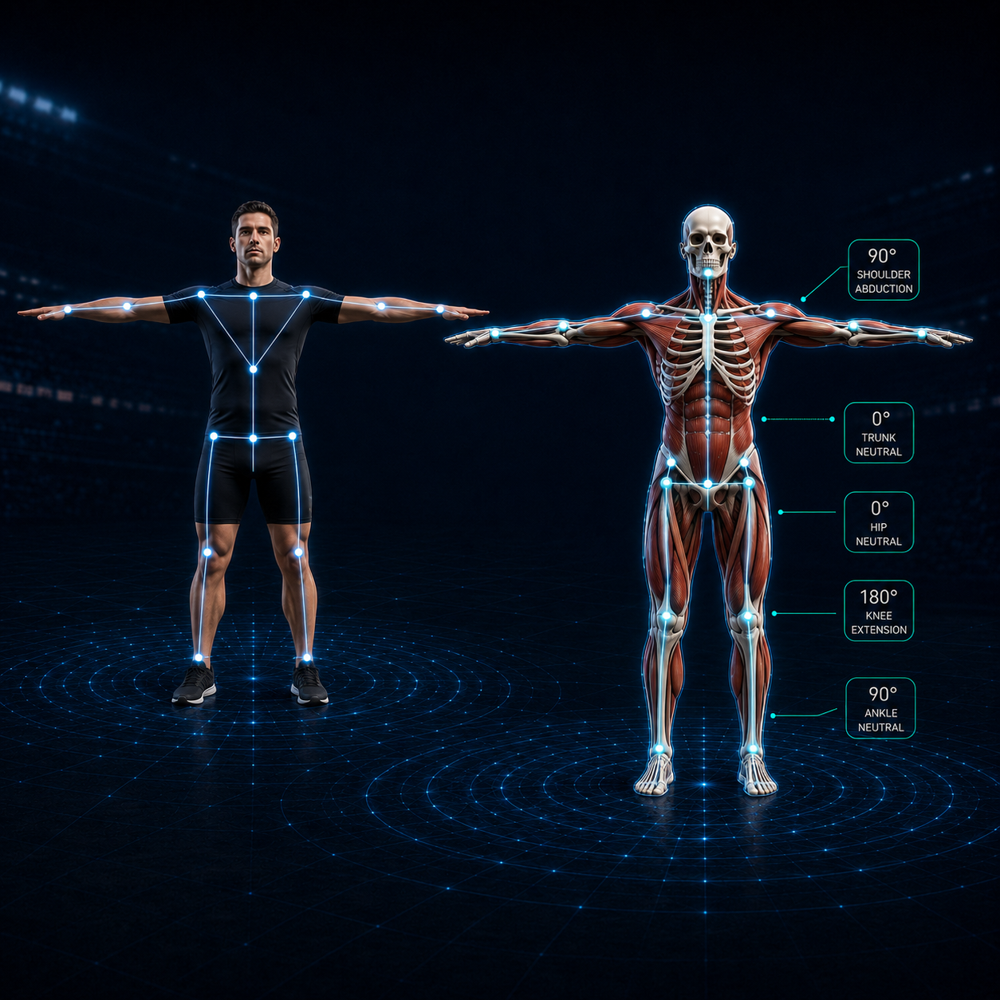

# Human3DMotion (H3DM)

<p align="center">
  
</p>

H3DM is a local web app for capture, calibration, pose estimation, 3D reconstruction, and kinematics analysis.

## Requirements

- Windows or macOS with Conda installed
- Node.js and npm
- Python 3.12, installed through the Conda environment files below
- Optional NVIDIA GPU support for pose estimation (Windows only)

## Install

Environment setup only, without building the app.

Windows (CMD or PowerShell), from the repository root:

```bat
scripts\env_setup.cmd
```

The script auto-detects the mode: GPU when `nvidia-smi` is available, CPU
otherwise. Force one explicitly with `scripts\env_setup.cmd gpu` or
`scripts\env_setup.cmd cpu`.

macOS (CPU):

```bash
bash scripts/env_setup.sh
```

Both scripts create or reuse the `human-3d-motion` Conda environment from
`environment-gpu.yml` / `environment-cpu.yml`, verify the pose backend, and
install the `h3dm` command into the environment.

```bash
conda activate human-3d-motion
```

Install frontend dependencies and build TypeScript:

```bash
npm install
npm run build:ts
```

### Pose models

Download the model files from Google Drive:

```text
https://drive.google.com/drive/folders/1aJ6LuDQF4ahWF9E_gj_r4981sVExRAN8?usp=sharing
```

Place the downloaded `models` folder here:

```text
pipelines/models
```

The pose pipeline expects model files under `pipelines/models`.

### VideoPose3D lifting weights

Only needed for automatic calibration on the Analysis page. The checkpoint is **not**
bundled with this project: it is published by Meta under CC BY-NC 4.0, which does not
permit commercial use, so you have to download it yourself.


The file is about 65 MB and must end up at exactly this path: [VideoPose3D](https://github.com/facebookresearch/VideoPose3D/blob/main/INFERENCE.md)

```text
pipelines/models/videopose3d/pretrained_h36m_detectron_coco.bin
```

Lifting runs on PyTorch; the CPU build is enough. Without the file, sessions that have no
calibration file stop with `videopose3d_checkpoint_not_found`; sessions that do have a
calibration are unaffected.

`node_modules/`, `webapp_data/`, and generated recording/analysis outputs are local artifacts and should not be committed.


## Build

Place the model files at `pipelines/models` first. Each build script runs the
matching environment setup for you, so running `env_setup` beforehand is
optional.

```bat
scripts\build.cmd
```

Like the setup script, it auto-detects GPU/CPU; pass `gpu` or `cpu` to force a
mode. The build installs frontend dependencies, builds TypeScript, generates the
executable icon from `images/human-3d-motion.png`, and creates:

```text
dist\Human3DMotion\Human3DMotion.exe
```

The output is a PyInstaller one-folder build. Keep the files beside the `.exe`
in `dist\Human3DMotion` together when moving the app.

macOS app (CPU):

```bash
bash scripts/build.sh
```

It generates an `.icns` icon from `images/human-3d-motion.png` and creates:

```text
dist/Human3DMotion.app
```

The macOS app is built locally for the architecture of the Python environment
that runs the build. Code signing and notarization are not part of this build
command.

## Run

Start the web app from the repository root:

```bat
h3dm
```

Default URL format:

```text
https://<internal-ip>:9090
```

To use another port:

```bat
set HUMAN_3D_MOTION_PORT=5001
h3dm
```


## Demo Data

Demo files are available from Google Drive:

```text
https://drive.google.com/drive/folders/1JD7Ye4nBwJI8rVy0jvVXBtfj6-yEsI_9?usp=drive_link
```

```text
intrinsic calibration info
CharucoBoard | DICT40x40 | 75 | 60 | 4 | 6
Extrinsic Calibration Info
Object
0.0, 0.0, 0.0
0.492, 0.0, 0.0
0.0, 0.0, 0.45
0.492, 0.0, 0.45
0.0, 0.492, 0.0
0.492, 0.492, 0.0
0.0, 0.492,0.45
0.492, 0.492, 0.45
```

Download the demo folder to a local path, then open the Analysis page and select that folder as the Analysis session root. The demo data should follow the same session filename format described below.


## Reference

1. Zeni Jr, J. A., Richards, J. G., & Higginson, J. (2008). Two simple methods for determining gait events during treadmill and overground walking using kinematic data. Gait & posture, 27(4), 710-714. / Detect Gait Events toe off, heel strike Using Heel, Toe, Sacrum (we use Hip instaed)

## Built On

H3DM adapts work from the following open-source projects. Each row lists what this
repository actually takes from the project and where that lands in the code.

| Project | Used for | Where | License |
| --- | --- | --- | --- |
| [Pose2Sim](https://github.com/perfanalytics/pose2sim) | OpenSim models, scaling/IK setup XML and marker sets; the weighted multi-view triangulation approach; person sorting from the companion Sports2D project | `pipelines/OpenSim_Setup/`, `pipelines/kinematics/`, `pipelines/reconstruction/` | BSD-3-Clause |
| [OpenCap](https://github.com/opencap-org/opencap-core) | LSTM marker augmenter (v0.3 lower/upper) that adds anatomical markers to the triangulated TRC | `pipelines/MarkerAugmenter/`, `pipelines/markerAugmentation.py` | Apache-2.0 |
| [VideoPose3D](https://github.com/facebookresearch/VideoPose3D) | Temporal dilated-convolution model that lifts 2D keypoints to 3D, used to obtain per-camera bone directions during automatic calibration | `pipelines/calibration/keypoints/lift3d.py` | **CC BY-NC 4.0 (non-commercial)** |
| [lab-camera-dynamic-calibrator](https://github.com/flodelaplace/lab-camera-dynamic-calibrator) | Markerless extrinsic calibration from human motion: linear solve from bone orientations, bundle adjustment, metric scaling | `pipelines/calibration/keypoints/` | MIT |
| [RTMPose](https://github.com/open-mmlab/mmpose/tree/main/projects/rtmpose) via [rtmlib](https://github.com/Tau-J/rtmlib) | 2D whole-body pose estimation (Halpe-26). `rtmlib` runs the bundled ONNX model without the full MMPose stack | `pipelines/pose_estimation/models.py`, `pipelines/models/*/rtmpose_end2end.onnx` | Apache-2.0 |
| [Ultralytics YOLO](https://github.com/ultralytics/ultralytics) | Person detection; the boxes RTMPose runs on | `pipelines/pose_estimation/models.py`, `pipelines/models/*/yolo_ckpt.pt` | **AGPL-3.0 (copyleft)** |
| [OpenSim](https://github.com/opensim-org/opensim-core) | Musculoskeletal model scaling and inverse kinematics | `pipelines/kinematics/` | Apache-2.0 |

### Licensing note

Most of the above is permissively licensed, but two entries carry obligations worth
knowing before you distribute anything built on this repository.

**VideoPose3D checkpoint — CC BY-NC 4.0.** Not redistributable and not usable
commercially, so it is deliberately not bundled here; you download it yourself (see
[VideoPose3D lifting weights](#videopose3d-lifting-weights)). It is only required for
automatic calibration. Capture, pose estimation, board-based calibration, reconstruction
and kinematics never touch it, so for commercial use calibrate with the Object or
CheckerBoard targets instead, or supply your own calibration file.

**Ultralytics YOLO — AGPL-3.0.** A strong copyleft licence: distributing or offering this
app over a network while it depends on Ultralytics generally requires releasing your own
source under AGPL-3.0 as well. Ultralytics sells a commercial licence for projects that
cannot do that. This affects the whole app, not just calibration, because person detection
runs on every analysis.

Neither point is legal advice; check with whoever owns the licensing decision for your
deployment.

